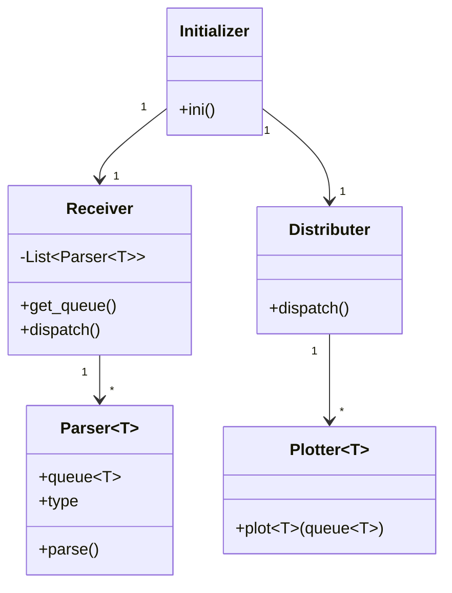

```mermaid
classDiagram

    class Initializer {
        +ini()
    }

    class Receiver {
       +get_queue()
       +dispatch()

       -List~Parser~T~~
    }

    class Parser~T~ {
        +queue~T~
        +type
        +parse()
    }

    class Distributer {

        +dispatch()
    }

    class Plotter~T~ {
        +plot~T~(queue~T~)
    }

    Initializer "1" --> "1" Receiver
    Initializer "1" --> "1"  Distributer
    Distributer "1" --> "*" Plotter
    Receiver "1" --> "*" Parser
```
